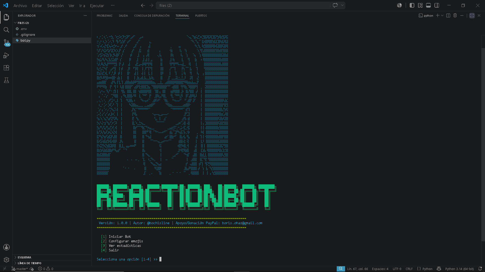

# ReactionBot
# 🎯 Discord Message Reactor Bot

> 💡 **Nota especial:** Si gustas ayudarme a arreglar y mejorar mi computadora, ¡estaría enormemente agradecido! Puedes contactarme o revisar la sección de apoyo al final de este documento.

Un bot interactivo en Python diseñado para escanear el historial de canales de texto y reaccionar automáticamente en tiempo real a los mensajes de un usuario objetivo específico dentro de los servidores de Discord.

---

## 📸 Vista Previa del Programa

<p align="center">
  
  <br>
  <em>Interfaz principal con menú interactivo y arte ASCII/Braille.</em>
</p>

<p align="center">
  
  <br>
  <em>Escaneo de historial en tiempo real y manejo de logs en la terminal.</em>
</p>

---

## 🚀 Características

- **Menú Interactivo en Terminal:** Administra las configuraciones en vivo sin necesidad de reiniciar el script.
- **Detección Dinámica de Usuarios:** Resuelve automáticamente el nombre del usuario en base a su ID de Discord mediante llamadas directas a la API.
- **Escaneo de Historial Completo:** Analiza los canales de texto de los servidores compartidos para reaccionar a mensajes antiguos.
- **Monitoreo en Tiempo Real:** Reacciona instántaneamente a los nuevos mensajes del usuario objetivo.
- **Manejo Inteligente de Rate Limits:** Sistema de mitigación de errores 429 (`Too Many Requests`) con reintentos automáticos para evitar bloqueos por parte de la API de Discord.
- **Robustez contra Errores:** Filtra automáticamente cadenas de texto inválidas en la configuración del ID.

## 🛠️ Requisitos Previos

Antes de ejecutar el bot, asegúrate de tener instalado Python 3.8 o superior y las dependencias del proyecto:

```bash
pip install discord.py python-dotenv colorama
